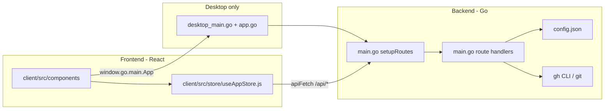

# Stitch Architecture

This document explains how Stitch is organized, how the frontend and backend connect, and where to put new code.

---

## High-level overview

Stitch is a **Go backend** + **React frontend** app. The backend wraps the GitHub CLI (`gh`) and local `git` commands. The frontend is a Vite + React SPA that talks to the backend over HTTP.

Stitch runs in three modes:

| Mode | How to start | What runs |
|------|--------------|-----------|
| **Web dev** | `npm run dev` | Air hot-reloads Go on `:4000` (`--server`); Vite serves React on `:5173` with `/api` proxied to Go |
| **Web production** | `npm run build && npm start` | Single Go binary serves REST API + static files from `dist/` |
| **Desktop (Wails)** | `wails dev` / `wails build` | Native window + embedded `dist/` assets; Go API still runs on `:4000` in the background |



---

## Folder structure

```
stitch/
├── main.go                 # Backend: models, config I/O, API handlers, route registration, main()
├── app.go                  # Desktop-only Wails bindings (methods exposed to JS)
├── desktop_main.go         # Wails window setup; embeds dist/; starts API server
├── go.mod / go.sum         # Go module dependencies
├── wails.json              # Wails packaging config (app name, output dir, frontend build cmd)
├── .air.toml               # Air hot-reload config for Go during `npm run dev`
├── package.json            # npm scripts; root-level dev orchestration
├── config.example.json     # Template for local repo list (committed)
├── config.json             # Your tracked repos + focus project (gitignored, local only)
│
├── client/                 # ── FRONTEND ──
│   ├── index.html          # Vite HTML shell
│   ├── vite.config.js      # Vite config (outDir → ../dist, /api proxy in dev)
│   └── src/
│       ├── main.jsx        # React entrypoint
│       ├── App.jsx         # Shell: header, sidebar, tab routing, energy filter
│       ├── store/
│       │   └── useAppStore.js   # Global Zustand state + apiFetch helper
│       ├── components/     # One file per sidebar tab / feature panel
│       │   ├── Sidebar.jsx
│       │   ├── Overview.jsx
│       │   ├── Repositories.jsx
│       │   ├── FocusWorkspace.jsx
│       │   ├── MajorProjects.jsx
│       │   ├── ProjectDetail.jsx
│       │   ├── Releases.jsx
│       │   ├── PRReviews.jsx
│       │   ├── Issues.jsx
│       │   ├── Builds.jsx
│       │   ├── Profile.jsx
│       │   ├── Roadmap.jsx
│       │   ├── Icon.jsx         # Shared SVG icons for sidebar tabs
│       │   └── Toast.jsx        # Toast notification provider
│       └── styles/
│           └── index.css   # Global styles (single CSS file today)
│
├── dist/                   # Vite build output (gitignored; embedded by Go)
├── build/                  # Wails .app bundle output (gitignored)
├── client/wailsjs/         # Auto-generated Wails JS bindings (gitignored)
├── tmp/                    # Air build cache (gitignored)
└── stitch-backend          # Compiled Go binary from npm run build:server (gitignored)
```

**Do not edit:** `dist/`, `build/`, `client/wailsjs/`, `tmp/`, `config.json` (local data).

**Legacy (unused):** `public/` — leftover from an earlier static HTML version; the active UI lives under `client/`.

---

## Frontend guide

### Entry flow

1. `client/index.html` loads `client/src/main.jsx`
2. `main.jsx` mounts `App.jsx` and imports `client/src/styles/index.css`
3. `App.jsx` renders the header, `Sidebar`, and the active tab component

### Where to add UI

| Task | File(s) |
|------|---------|
| New sidebar tab / screen | Create `client/src/components/YourFeature.jsx`, register in `App.jsx` (`TABS` array + `renderSection` switch) |
| New sidebar icon | Add SVG path in `client/src/components/Icon.jsx` |
| Global shared state (repos, focus, active tab) | `client/src/store/useAppStore.js` |
| Layout / header / energy filter | `client/src/App.jsx` |
| Global styling | `client/src/styles/index.css` |
| Tab-specific styling | Prefer class names in the component; add rules to `index.css` if needed |

### Calling the backend

Always use **`apiFetch`** from `useAppStore.js` for REST calls. It picks the correct base URL:

- **Browser dev** (`npm run dev`): relative `/api/...` → Vite proxy → `http://127.0.0.1:4000`
- **Desktop / production**: absolute `http://127.0.0.1:4000/api/...`

```js
import { apiFetch } from '../store/useAppStore';

const res = await apiFetch('/api/issues');
const data = await res.json();
```

For mutations that affect repo list state, add an action to `useAppStore.js` (see `loadRepos`, `addRepo`, `toggleMajor`).

### Desktop-only behavior

When running inside Wails, `window.go.main.App` is available (generated into `client/wailsjs/`). Used today for:

- **`OpenURL(url)`** — open GitHub links in the system browser (`App.jsx`)
- Direct Wails method calls are optional; most features use the REST API instead

Detect desktop mode the same way as `apiFetch`:

```js
const isDesktop = window.go !== undefined || import.meta.env.PROD;
```

### Component pattern

Each tab component is a self-contained React module that:

1. Reads shared state from `useAppStore` when needed (`repos`, `focusProject`, etc.)
2. Fetches its own panel data in `useEffect` via `apiFetch`
3. Renders loading/empty states inline

See `client/src/components/Overview.jsx` for a typical example.

---

## Backend guide

All server logic currently lives in **`main.go`** (handlers + helpers) with desktop bindings in **`app.go`**.

### Where to add backend code

| Task | File(s) |
|------|---------|
| New REST endpoint | Add `handleYourFeature` in `main.go`, register in `setupRoutes()` |
| Shared data types | `Repo`, `Config` structs at top of `main.go` |
| Read/write local repo list | `readConfig()` / `writeConfig()` in `main.go` |
| Shell out to `gh` or `git` | `runCmd(command, workingDir)` in `main.go` |
| Parse git remote → owner/name | `getRepoInfoFromGit()` in `main.go` |
| Desktop-native method (no HTTP) | Add method on `App` in `app.go`; re-run `wails dev` to regenerate `client/wailsjs/` |
| Change API port | `main()` default `:4000` or `PORT` env var; also used by `desktop_main.go` |

### API route map

Routes are registered in `setupRoutes()`:

| Prefix | Handlers | Purpose |
|--------|----------|---------|
| `/api/repos` | GET, POST, DELETE | List, add, remove tracked repos |
| `/api/repos/toggle-major` | POST | Star/unstar major project |
| `/api/repos/set-focus` | POST | Set active focus workspace |
| `/api/projects/details` | GET | Major project deep-dive data |
| `/api/roadmap`, `/api/roadmap/add` | GET, POST | GitHub issue–backed roadmap |
| `/api/releases`, `/api/release/create` | GET, POST | Tag/release workflow |
| `/api/focus/info`, `/api/focus/contents` | GET | Focus workspace git + file tree |
| `/api/recents`, `/api/prs`, `/api/issues` | GET | Aggregated GitHub activity |
| `/api/build/run` | GET (SSE) | Stream build/lint output |
| `/api/contributions`, `/api/contributions/local` | GET | Contribution graphs |
| `/api/profile`, `/api/profile/git` | GET, POST | Developer profile + git config |
| `/` | GET | Serves `dist/` in production server mode |

### Adding a new REST endpoint (checklist)

1. **Handler** — add `func handleMyFeature(w http.ResponseWriter, r *http.Request)` in `main.go`
2. **Register** — in `setupRoutes()`, add e.g. `mux.HandleFunc("GET /api/my-feature", wrap(handleMyFeature))`
3. **Frontend** — call it from the relevant component via `apiFetch('/api/my-feature')`
4. **Optional store action** — if the response should update global state, extend `useAppStore.js`

Handler conventions in this codebase:

- Use `readConfig()` / `writeConfig()` for anything stored in `config.json`
- Use `runCmd("gh ...", dir)` or `runCmd("git ...", dir)` for external tools
- Return JSON with `json.NewEncoder(w).Encode(...)` or `w.Write([]byte(...))`
- Use `http.Error` for failures

### Entry points

```go
// main.go
func main() {
    if --server flag → HTTP server on :4000 (dev + production)
    else              → runDesktopApp() in desktop_main.go
}
```

- **`npm run dev:server`** → Air rebuilds and runs `./tmp/main --server`
- **`npm start`** → `./stitch-backend --server` (after build)
- **`wails dev` / double-click Stitch.app** → `runDesktopApp()` (no `--server` flag)

---

## Configuration

`config.json` (copy from `config.example.json`) is the local database:

```json
{
  "repos": [
    {
      "name": "my-app",
      "owner": "you",
      "path": "/absolute/path/to/clone",
      "isMajorProject": false,
      "buildScripts": ["npm run build", "go build"]
    }
  ],
  "focusProject": "/absolute/path/to/clone"
}
```

- **Local repos** have a `path` on disk.
- **Web-only repos** can be tracked with `owner` + `name` and no `path`.
- Never commit `config.json` — it contains machine-specific paths.

---

## Build & generated artifacts

| Path | Produced by | Committed? |
|------|-------------|------------|
| `dist/` | `npm run build:client` | No — embedded into Go binary |
| `stitch-backend` | `npm run build:server` | No |
| `build/bin/Stitch.app` | `wails build` | No |
| `client/wailsjs/` | `wails dev` / `wails build` | No |
| `tmp/` | Air during dev | No |

Production web flow: `npm run build` → `npm start` → Go serves API + `dist/`.

Desktop flow: `cd client && npm run build` → `wails build -s` → `build/bin/Stitch.app`.

---

## Quick reference: common changes

### “I want to change how a screen looks”
→ Edit the matching file in `client/src/components/`, styles in `client/src/styles/index.css`.

### “I want a new tab in the sidebar”
1. `client/src/components/NewTab.jsx`
2. Register in `App.jsx` (`TABS` + `renderSection`)
3. Add icon in `Icon.jsx` if needed

### “I want new data from GitHub / git”
1. Add handler in `main.go` using `runCmd`
2. Register route in `setupRoutes()`
3. Fetch from the component with `apiFetch`

### “I want shared state across tabs”
→ Add state + actions to `client/src/store/useAppStore.js`.

### “I want desktop-native behavior (open folder, system dialog)”
→ Add a method on `App` in `app.go`, call via `window.go.main.App.YourMethod()` from the frontend.

### “I want to change the desktop window (title, size, macOS chrome)”
→ `desktop_main.go` (`options.App`, `mac.Options`).

---

## External dependencies

| Tool | Role |
|------|------|
| [GitHub CLI (`gh`)](https://cli.github.com/) | Auth, issues, PRs, releases, API calls — must be installed and logged in |
| `git` | Local branch status, remotes, commits |
| Go 1.21+ | Backend |
| Node.js | Frontend dev/build |
| [Wails v2](https://wails.io/) | Optional desktop packaging |
| [Air](https://github.com/air-verse/air) | Go hot reload in dev (via `npm run dev:server`) |

---

## Related docs

- [README.md](./README.md) — setup, features, run commands
- [CONTRIBUTING.md](./CONTRIBUTING.md) — fork, PR, and dev setup
