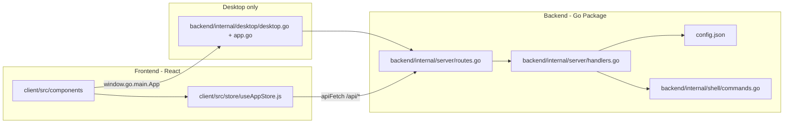

# Stitch Architecture

This document explains how Stitch is organized, how the frontend and backend connect, and where to put new code.

---

## High-level overview

Stitch is a **Go backend** + **React frontend** app. The backend wraps the GitHub CLI (`gh`) and local `git` commands. The frontend is a Vite + React SPA that talks to the backend over HTTP.

Stitch runs in three modes:

| Mode | How to start | What runs |
|------|--------------|-----------|
| **Web dev** | `npm run dev` | Air hot-reloads Go inside `/backend` on `:4000` (`--server`); Vite serves React on `:5173` with `/api` proxied to Go |
| **Web production** | `npm run build && npm start` | Single Go binary serves REST API + static files from `backend/dist/` |
| **Desktop (Wails)** | `wails dev` / `wails build` | Native window + embedded `backend/dist/` assets; Go API still runs on `:4000` in the background |



---

## Folder structure

```
stitch/
├── backend/                # ── BACKEND ──
│   ├── main.go             # Entrypoint parsing CLI arguments and routing targets
│   ├── wails.json          # Wails desktop packaging config
│   ├── .air.toml           # Air hot-reload config for dev
│   ├── go.mod / go.sum     # Go dependencies
│   ├── dist/               # Vite build output (embedded into desktop app)
│   └── internal/
│       ├── config/         # config.json I/O operations
│       ├── models/         # Shared struct types (Repo, Config)
│       ├── shell/          # Command exec and Git/GitHub CLI wrappers
│       ├── server/         # REST API server (routes & request handlers)
│       └── desktop/        # Wails bootstrap configs & JS bindings (app.go)
│
├── client/                 # ── FRONTEND ──
│   ├── index.html          # Vite HTML shell
│   ├── vite.config.js      # Vite config (outDir → ../backend/dist)
│   └── src/
│       ├── main.jsx        # React entrypoint
│       ├── App.jsx         # Shell layout, tab routers & external link interceptors
│       ├── store/
│       │   └── useAppStore.js   # Global Zustand state + apiFetch helper
│       └── components/     # UI feature views (Overview, Repositories, Profile...)
│
├── config.json             # Local repos database (gitignored)
├── build/                  # Wails Stitch.app build output (gitignored)
└── stitch-backend          # Compiled Go binary from npm run build:server (gitignored)
```

---

## Frontend guide

### Entry flow

1. `client/index.html` loads `client/src/main.jsx`
2. `main.jsx` mounts `App.jsx` and imports `client/src/styles/index.css`
3. `App.jsx` renders the header, `Sidebar`, and the active tab component

### Where to add UI

| Task | File(s) |
|------|---------|
| New sidebar tab / screen | Create `client/src/components/YourFeature.jsx`, register in `App.jsx` (`TABS` array + `renderSection` switch) |
| New sidebar icon | Add SVG path in `client/src/components/Icon.jsx` |
| Global shared state (repos, focus, active tab) | `client/src/store/useAppStore.js` |
| Layout / header / energy filter | `client/src/App.jsx` |
| Global styling | `client/src/styles/index.css` |

### Calling the backend

Always use **`apiFetch`** from `useAppStore.js` for REST calls. It picks the correct base URL:

- **Browser dev** (`npm run dev`): relative `/api/...` → Vite proxy → `http://127.0.0.1:4000`
- **Desktop / production**: absolute `http://127.0.0.1:4000/api/...`

```js
import { apiFetch } from '../store/useAppStore';

const res = await apiFetch('/api/issues');
const data = await res.json();
```

---

## Backend guide

All backend Go logic lives inside the `/backend` folder.

### Where to add backend code

| Task | File(s) |
|------|---------|
| New REST endpoint | Add handler in `backend/internal/server/handlers.go`, register route in `routes.go` |
| Shared data types | Add struct type to `backend/internal/models/models.go` |
| Read/write config.json | Add functionality to `backend/internal/config/config.go` |
| Shell execution / commands | Implement in `backend/internal/shell/shell.go` |
| Desktop-native bindings | Implement inside `backend/internal/desktop/app.go` (exposed to JS runtime) |

### Adding a new REST endpoint (checklist)

1. **Handler** — add `func HandleMyFeature(w http.ResponseWriter, r *http.Request)` in `backend/internal/server/handlers.go`
2. **Register** — in `routes.go`, add e.g. `mux.HandleFunc("GET /api/my-feature", wrap(HandleMyFeature))`
3. **Frontend** — call it from the relevant component via `apiFetch('/api/my-feature')`

---

## External dependencies

| Tool | Role |
|------|------|
| [GitHub CLI (`gh`)](https://cli.github.com/) | Auth, issues, PRs, releases, API calls — must be installed and logged in |
| `git` | Local branch status, remotes, commits |
| Go 1.24+ | Backend development & Wails binding |
| Node.js | Frontend dev/build |
| [Wails v2](https://wails.io/) | Standalone desktop application packaging |
| [Air](https://github.com/air-verse/air) | Go hot reload in dev (via `npm run dev:server`) |
