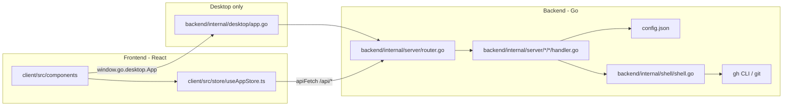

# Stitch Architecture

This document explains how Stitch is organized, how the frontend and backend connect, and where to put new code.

---

## High-level overview

Stitch is a **Go backend** + **React frontend** app. The backend wraps the GitHub CLI (`gh`) and local `git` commands via a thin shell executor. The frontend is a Vite + React 19 SPA that talks to the backend over HTTP using a central `apiFetch` helper.

Stitch runs in three modes:

| Mode | How to start | What runs |
|------|-------------|-----------|
| **Web dev** | `npm run dev` | Air hot-reloads Go on `:4000` (`--server`); Vite serves React on `:5173` with `/api` proxied to Go |
| **Web production** | `npm run build && npm start` | Single Go binary serves REST API + static files from `backend/dist/` |
| **Desktop (Wails)** | `wails dev` / `wails build` | Native window + embedded `backend/dist/` assets; Go API still runs on `:4000` in the background |


```mermaid
flowchart LR
  subgraph frontend [Frontend - React]
    UI[client/src/components]
    Store[client/src/store/useAppStore.ts]
    UI --> Store
  end

  subgraph backend [Backend - Go]
    Router[backend/internal/server/router.go]
    Handlers[backend/internal/server/*/*/handler.go]
    Config[config.json]
    Router --> Handlers
    Handlers --> Config
    Handlers --> Shell[backend/internal/shell/shell.go]
    Shell --> GH[gh CLI / git]
  end

  subgraph desktop [Desktop only]
    Wails[backend/internal/desktop/app.go]
    Wails --> Router
  end

  Store -->|apiFetch /api/*| Router
  UI -->|window.go.desktop.App| Wails
```

---

## Folder structure

```
stitch/
├── backend/                        # ── BACKEND ──
│   ├── main.go                     # Entrypoint: parses --server / --desktop flags
│   ├── wails.json                  # Wails desktop packaging config
│   ├── .air.toml                   # Air hot-reload config for dev
│   ├── go.mod / go.sum             # Go dependencies
│   ├── dist/                       # Vite build output (embedded into desktop app)
│   └── internal/
│       ├── config/                 # config.json I/O (read/write tracked repos)
│       ├── models/                 # Shared struct types: Repo, Config
│       ├── shell/                  # exec.Command wrapper (RunCmd) + GetRepoInfoFromGit
│       ├── plans/                  # Plans domain logic
│       └── server/                 # REST API
│           ├── router.go           # All route registrations in one place
│           ├── server.go           # HTTP server bootstrap
│           ├── repos/              # GET/POST/DELETE repos, toggle-major, set-focus, tab-energies
│           ├── contributions/      # PRs, issues, GitHub contribution graph, local commits
│           ├── focus/              # Focus repo info + file/directory contents (via gh)
│           ├── ideas/              # Markdown ideas files CRUD (scoped to a repo)
│           ├── plans/              # Plans CRUD + promote-to-issue
│           ├── releases/           # Tag listing + release creation
│           ├── roadmap/            # Remote roadmap issue sync
│           ├── build/              # SSE streaming build/lint runner
│           ├── monitor/            # AI provider disk usage scanner + media cleanup
│           ├── profile/            # Git config read/write + environment checks
│           └── helpers/            # Shared handler utilities
│
├── client/                         # ── FRONTEND ──
│   ├── index.html                  # Vite HTML shell
│   ├── vite.config.js              # Vite config (outDir → ../backend/dist)
│   └── src/
│       ├── main.jsx                # React entrypoint
│       ├── App.jsx                 # Shell layout, energy panel, tab router
│       ├── helper/                 # Utility functions (compileMarkdown, confirmDialog)
│       ├── store/
│       │   └── useAppStore.ts      # Global Zustand state + apiFetch helper
│       └── components/             # UI feature views
│           ├── Overview.tsx        # Home dashboard (stats, PRs, issues, contribution graph)
│           ├── Repositories.tsx    # Repo manager (add/remove/toggle-major/set-focus)
│           ├── FocusWorkspace.tsx  # Deep-work mode (file explorer, build runner)
│           ├── MajorProjects.tsx   # Starred projects list
│           ├── ProjectDetail.tsx   # Per-project detail (features/bugs/reviews/roadmap)
│           ├── IdeasEditor.tsx     # Markdown ideas file editor (edit / preview / split)
│           ├── Releases.tsx        # Tag releases across all repos
│           ├── PRReviews.tsx       # Open PR reviews
│           ├── Issues.tsx          # Open issues across all repos
│           ├── Builds.tsx          # Build/lint task runner
│           ├── AIMonitor.tsx       # AI provider disk usage monitor + cleanup
│           ├── Profile.tsx         # Git config + environment runtime checks
│           ├── Roadmap.tsx         # Remote roadmap issue viewer
│           ├── Sidebar.tsx         # Navigation sidebar (energy-filtered tabs)
│           ├── Toast.tsx           # Toast notification system (context + provider)
│           ├── Icon.tsx            # SVG icon component
│           ├── focus/
│           │   ├── PomodoroTimer.tsx       # 25/5/15 work-break timer
│           │   ├── FocusChecklist.tsx      # Per-project task list (localStorage)
│           │   ├── FocusScratchpad.tsx     # Per-project freeform notes (localStorage)
│           │   └── ArchitectureDiagram.tsx # Interactive React Flow architecture canvas
│           └── ui/
│               ├── Badge.tsx               # Reusable status/tag badges
│               ├── EmptyState.tsx          # Standardized empty states
│               └── StatCard.tsx            # Metric & KPI statistics cards
│
├── config.json                     # Local repos database (gitignored)
├── config.example.json             # Template to bootstrap config.json
├── build/                          # Wails Stitch.app build output (gitignored)
└── stitch-backend                  # Compiled Go binary from npm run build:server (gitignored)
```

---

## Frontend guide

### Entry flow

1. `client/index.html` loads `client/src/main.jsx`
2. `main.jsx` mounts `App.jsx` wrapped in `ToastProvider`
3. `App.jsx` renders the header, `Sidebar`, active tab component, and the floating `EnergyPanel`

### Energy filtering

Tabs have an `energy` field (`'low'`, `'medium'`, `'high'`, or `'all'`). `App.jsx` filters `TABS` against the active energy mode set in the floating `EnergyPanel` FAB. If the currently active tab gets filtered out, it automatically switches to the first visible tab.

### Where to add UI

| Task | File(s) |
|------|---------|
| New sidebar tab / screen | Create `client/src/components/YourFeature.tsx`, register in `App.jsx` (`TABS` array + `renderSection` switch) |
| New sidebar icon | Add an SVG path entry in `client/src/components/Icon.tsx` |
| Global shared state (repos, focus, active tab, energy) | `client/src/store/useAppStore.ts` |
| Layout / header / energy filter | `client/src/App.jsx` |
| Reusable confirm dialog | `client/src/helper/confirm.ts` (`confirmDialog()`) |
| Toast notifications | `useToast()` from `client/src/components/Toast.tsx` |

### Calling the backend

Always use **`apiFetch`** from `useAppStore.ts` for REST calls. It picks the correct base URL automatically:

- **Browser dev** (`npm run dev`): relative `/api/...` → Vite proxy → `http://127.0.0.1:4000`
- **Desktop / production**: absolute `http://127.0.0.1:4000/api/...`

```ts
import { apiFetch } from '../store/useAppStore';

const res = await apiFetch('/api/issues');
const data = await res.json();
```

---

## Backend guide

All Go logic lives inside `backend/`. Each feature area is a sub-package under `backend/internal/server/`.

### Where to add backend code

| Task | File(s) |
|------|---------|
| New REST endpoint | Create `backend/internal/server/<feature>/handler.go`, register route in `router.go` |
| Shared data types | Add struct to `backend/internal/models/models.go` |
| Read/write config.json | Add functionality to `backend/internal/config/config.go` |
| Shell execution / CLI commands | Use `shell.RunCmd(command, workingDir)` from `backend/internal/shell/shell.go` |
| Desktop-native bindings | Implement in `backend/internal/desktop/app.go` (exposed to JS via Wails runtime) |

### Adding a new REST endpoint (checklist)

1. **Create handler** — add `backend/internal/server/<feature>/handler.go` with your handler func(s).
2. **Register route** — in `router.go`, add e.g. `mux.HandleFunc("GET /api/my-feature", myfeature.HandleMyFeature)`.
3. **Frontend** — call it from the relevant component via `apiFetch('/api/my-feature')`.

### API route reference

| Method | Route | Description |
|--------|-------|-------------|
| GET | `/api/repos` | List tracked repos |
| POST | `/api/repos` | Add a repo |
| DELETE | `/api/repos` | Remove a repo |
| POST | `/api/repos/toggle-major` | Toggle major project flag |
| POST | `/api/repos/set-focus` | Set the focus project |
| POST | `/api/config/tab-energies` | Save per-tab energy assignments |
| GET | `/api/projects/details` | Major project detail (features/bugs/reviews) |
| GET | `/api/roadmap` | Fetch roadmap from remote GitHub issue |
| POST | `/api/roadmap/add` | Add roadmap item to remote issue |
| GET | `/api/releases` | List releases across tracked repos |
| POST | `/api/release/create` | Create a new release tag |
| GET | `/api/focus/info` | Focused repo info (branch, status) |
| GET | `/api/focus/contents` | File/directory contents for a repo |
| GET | `/api/ideas` | List ideas markdown files |
| GET | `/api/ideas/file` | Read a specific ideas file |
| POST | `/api/ideas/file` | Write/create an ideas file |
| DELETE | `/api/ideas/file` | Delete an ideas file |
| GET | `/api/plans` | List plans |
| POST | `/api/plans` | Create a plan |
| PUT | `/api/plans` | Update a plan |
| DELETE | `/api/plans` | Delete a plan |
| POST | `/api/plans/promote` | Promote a plan to a GitHub issue |
| GET | `/api/prs` | Open PRs across tracked repos |
| GET | `/api/issues` | Open issues across tracked repos |
| GET | `/api/recents` | Recent contributions |
| GET | `/api/contributions` | GitHub contribution graph data |
| GET | `/api/contributions/local` | Local git commit history |
| GET | `/api/build/run` | SSE stream: run a build/lint script |
| GET | `/api/profile` | Read Git config + env runtime versions |
| POST | `/api/profile/git` | Write Git config |
| GET | `/api/provider/{provider}/disk` | AI provider disk usage |
| DELETE | `/api/provider/{provider}/media` | Clean up AI provider media files |

---

## External dependencies

| Tool | Role |
|------|------|
| [GitHub CLI (`gh`)](https://cli.github.com/) | Auth, issues, PRs, releases, repo contents — must be installed and logged in |
| `git` | Local branch status, remotes, commits |
| Go 1.24+ | Backend development & Wails binding |
| Node.js 18+ | Frontend dev/build |
| [React 19](https://react.dev/) | UI framework |
| [Zustand 5](https://zustand.docs.pmnd.rs/) | Frontend global state |
| [@xyflow/react](https://reactflow.dev/) | Interactive architecture diagram canvas |
| [Wails v2](https://wails.io/) | Standalone desktop application packaging |
| [Air](https://github.com/air-verse/air) | Go hot reload in dev (via `npm run dev:server`) |
| [Vite](https://vitejs.dev/) | Frontend bundler with HMR |
