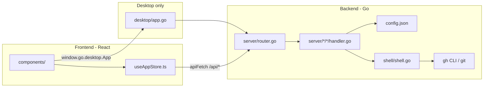

# Stitch 🧵

[](../../issues?q=is%3Aopen+label%3Ahacktoberfest)
[](../../issues?q=is%3Aopen+label%3A%22good+first+issue%22)

Stitch is a productivity-first developer dashboard that groups and manages your GitHub repositories (both local clones and web-only remotes) by your active energy level (Low, Medium, High).

It aggregates issues, PR reviews, tag releases, and build states into a single workspace, using the official GitHub CLI (`gh`) under the hood so credentials stay secure and local.

> 🎃 **Hacktoberfest**: Stitch is open for contributions! Check the [`good first issue`](../../issues?q=is%3Aopen+label%3A%22good+first+issue%22) label to get started. Read [CONTRIBUTING.md](./CONTRIBUTING.md) for guidelines.

---

## Features

### 🏠 Home Overview
Aggregates all tracked repos into a single dashboard — total repo count, open PRs, open issues, day streak, local vs. web breakdown, and a live GitHub contribution graph.

### 📁 Repositories Workspace
Add local repo directories or web-only GitHub remotes. Toggle focus tags, star primary projects, and manage your tracked repo list.

### ⚡ Energy-Guided Navigation
A floating panel lets you switch between three energy modes that filter which tabs are visible:

| Mode | Tabs shown |
|------|-----------|
| **Low** | PR Reviews · Issues |
| **Medium** | Releases · Major Projects |
| **High** | Focus Workspace · Builds |

### 🎯 Focus Workspace
Deep-work mode for your currently focused repo. Includes:
- **File explorer** — browse local or remote repo contents and view file contents inline.
- **Architecture Diagram** — interactive node-edge canvas (powered by React Flow) to sketch and persist your repo's architecture.
- **Focus Checklist** — per-project task list persisted to `localStorage`.
- **Focus Scratchpad** — freeform markdown notes scoped to the active project.
- **Pomodoro Timer** — 25/5/15 work-break cycles with chime, session counter, and `localStorage` persistence.
- **Build Runner** — stream live build/lint output from the repo's configured scripts via SSE.

### ⭐ Major Projects Deep-Dive
Clicking a starred project opens a detail workspace partitioning features, bugs, reviews, issues, and a remote-synced roadmap. Includes an **Ideas Editor** — a markdown file manager that reads and writes `.md` files directly from the repo via the GitHub API.

### 🗺️ Remote Roadmap Sync
Roadmap items are saved to and read from a GitHub issue tagged with the label `roadmap`. The label and issue are automatically created on the remote if they don't exist.

### 📦 Releases
View tag releases across all tracked repos. Cut a new release (tag + notes) directly from the UI.

### 🤖 AI Provider Monitor
Inspect and clean up disk usage from local AI tool caches (Gemini, Claude, OpenAI, Anthropic, Cursor) — screenshots, recordings, and media stored under `~/.<provider>`.

### 👤 Developer Profile
Configure global Git properties (`user.name`, `user.email`) and run environment runtime checks (Go, Node, Python, Postgres, Redis) and macOS diagnostics from one screen.

---

## Architecture

```
stitch/
  backend/                   ← Go backend (REST API + Wails desktop)
    main.go                  ← Entrypoint: parses --server / --desktop flags
    internal/
      config/                ← config.json read/write
      models/                ← Shared struct types (Repo, Config)
      shell/                 ← exec.Command wrapper + Git/gh CLI helpers
      server/                ← REST API
        router.go            ← Route registration
        repos/               ← CRUD + toggle-major + set-focus + tab-energies
        contributions/       ← PRs, issues, GitHub contribution graph
        focus/               ← Focus repo info + file contents
        ideas/               ← Markdown ideas file CRUD
        plans/               ← Plans CRUD + promote
        releases/            ← Tag listing + release creation
        roadmap/             ← Remote roadmap issue sync
        build/               ← SSE build/lint runner
        monitor/             ← AI provider disk usage + cleanup
        profile/             ← Git config read/write
      desktop/               ← Wails app bootstrap + JS bindings (app.go)
  client/                    ← Vite + React 19 + TypeScript frontend
    src/
      store/useAppStore.ts   ← Zustand global state + apiFetch routing wrapper
      components/            ← Tab panels & UI elements
        focus/               ← PomodoroTimer, FocusChecklist, FocusScratchpad,
                                ArchitectureDiagram (React Flow)
        ui/                  ← Badge, EmptyState, StatCard
  config.json                ← Local repo database (gitignored)
```

### How the layers connect



Stitch runs in three modes:

| Mode | How to start | What runs |
|------|-------------|-----------|
| **Web dev** | `npm run dev` | Air hot-reloads Go on `:4000`; Vite serves React on `:5173` with `/api` proxied |
| **Web production** | `npm run build && npm start` | Single Go binary serves REST API + static files |
| **Desktop (Wails)** | `wails dev` / `wails build` | Native window + embedded assets; Go API still on `:4000` |

---

## Setup & Running

### Prerequisites

- **Go 1.24+**
- **Node.js 18+**
- **GitHub CLI** installed and authenticated:

```bash
gh --version
gh auth login
```

### 1. Clone & Install

```bash
git clone https://github.com/manas2297/stitch.git
cd stitch
npm install
go mod tidy   # from the backend/ directory
```

### 2. Configure

```bash
cp config.example.json config.json
```

### 3. Run in Dev Mode (hot reload)

```bash
npm run dev
```

- Backend (Go + Air): `http://localhost:4000`
- Frontend (Vite): `http://localhost:5173` ← open this in your browser

---

## Desktop App (Wails)

Stitch can be packaged as a standalone `.app` (macOS) using Wails.

### Install Wails

```bash
go install github.com/wailsapp/wails/v2/cmd/wails@latest
```

### Dev mode (live-reload GUI window)

Before first run, ensure you've run `npm install` from the repo root and copied `config.example.json` to `config.json`.

```bash
cd backend
~/go/bin/wails dev
```

### Build production `.app`

```bash
# 1. Compile frontend assets
npm run build:client

# 2. Package the app bundle
cd backend && ~/go/bin/wails build -s
```

Output: **`build/bin/Stitch.app`**

---

## Tech Stack

| Layer | Technology |
|-------|-----------|
| Frontend | React 19, TypeScript, Vite, Zustand |
| Diagrams | [@xyflow/react](https://reactflow.dev/) (React Flow) |
| Backend | Go 1.24+ |
| Desktop | [Wails v2](https://wails.io/) |
| Dev hot-reload | [Air](https://github.com/air-verse/air) (Go), Vite HMR (React) |
| Auth / GitHub API | [GitHub CLI (`gh`)](https://cli.github.com/) |
| Local Git | `git` CLI |

---

## Contributing

Contributions are welcome! Please read [CONTRIBUTING.md](./CONTRIBUTING.md) before opening a pull request.

- Browse open [`good first issue`](../../issues?q=is%3Aopen+label%3A%22good+first+issue%22) tasks.
- Use the issue templates when reporting bugs or proposing features.
- All PRs must be linked to an open issue.
